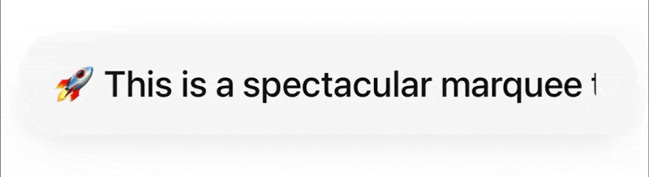
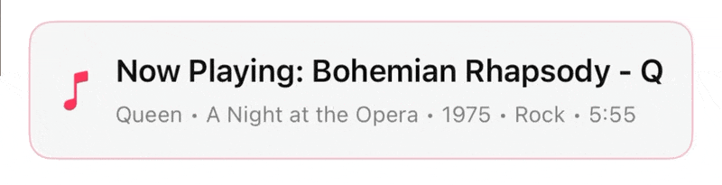
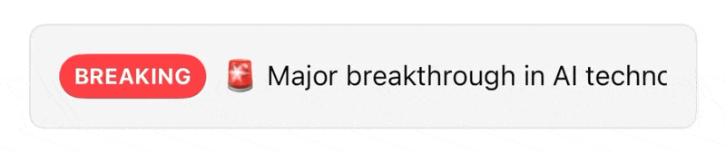
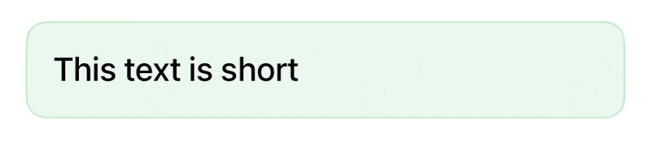
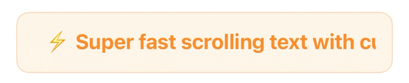
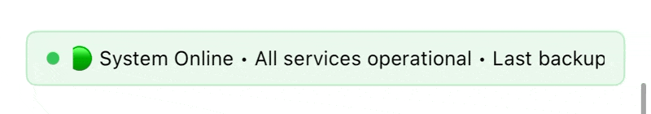
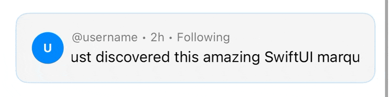
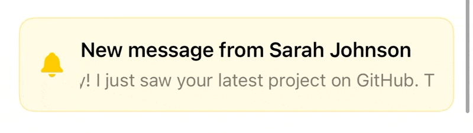
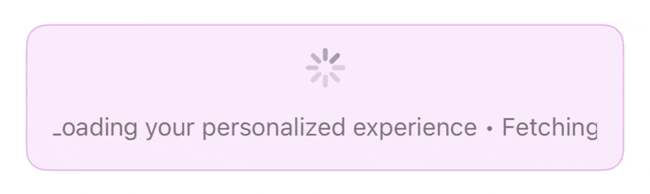
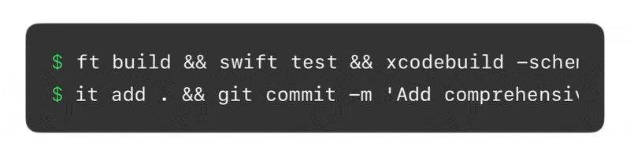

# MarqueeText

[](https://github.com/harflabs/MarqueeText/actions/workflows/test.yml)
[](https://codecov.io/gh/harflabs/MarqueeText)
[](https://swiftpackageindex.com/harflabs/MarqueeText)
[](https://swiftpackageindex.com/harflabs/MarqueeText)
[](LICENSE)

A lightweight SwiftUI component that automatically creates marquee scrolling animations when text overflows its container. Perfect for music players, news tickers, status displays, and more.

## Features

- 🎯 **Automatic Detection** - Only scrolls when text overflows
- ⚡️ **Smooth Animations** - Customizable duration, delay, and spacing
- 🎨 **SwiftUI Native** - Built with pure SwiftUI
- ♿️ **Accessible** - VoiceOver-friendly labels with Reduce Motion support
- ↔️ **Localizable** - Supports `LocalizedStringResource` and right-to-left layouts
- 📱 **Multi-Platform** - iOS, macOS, tvOS, visionOS, and watchOS

## Requirements

- iOS 16.0+
- macOS 13.0+
- tvOS 16.0+
- visionOS 1.0+
- watchOS 9.0+

## Installation

### Swift Package Manager

Add the following to your `Package.swift` file:

```swift
dependencies: [
    .package(url: "https://github.com/harflabs/MarqueeText.git", from: "1.2.0")
]
```

Or add it through Xcode:
1. File → Add Package Dependencies
2. Enter the repository URL
3. Select version and add to your target

## Usage

### Basic Usage

```swift
import MarqueeText

MarqueeText("This is a long text that will scroll smoothly across the screen!")
```

String literals use SwiftUI's localized string resource behavior. For runtime strings, such as titles from an API,
you can pass a `String` value directly or use the explicit verbatim initializer when you want to make that intent
clear:

```swift
let title = "Now Playing: Bohemian Rhapsody - Queen"

MarqueeText(title)
MarqueeText(verbatim: title)
```

### Layout Behavior

`MarqueeText` measures the rendered text and available width, so short text stays static and overflowing text scrolls.
It remeasures when SwiftUI layout changes, including font, Dynamic Type, locale, and container size updates. This keeps
the marquee responsive in lists, stacks, compact controls, and during device rotation.

Right-to-left layout direction mirrors the marquee alignment and scroll direction.

`MarqueeText` is layout-interchangeable with a single line `Text`:

- It reports the same size for every proposal, **including on the first layout pass**, so dropping it into a `List`,
  `LazyVStack`, or toolbar never shifts surrounding layout on the following frame.
- A generous height proposal does not stretch it, so it behaves like `Text` — not like `Color` — inside `ZStack`,
  overlays, and stacks with taller siblings.
- Text baselines are forwarded, so it lines up in `HStack(alignment: .firstTextBaseline)`.
- Only the horizontal axis is clipped. Glyphs that legitimately paint outside the line box — Arabic diacritics,
  emoji, tall accents — render exactly as `Text` renders them.

These guarantees are covered by tests that compare `MarqueeText` against a real `Text` in a hosting view.

### Performance

`MarqueeText` is built to survive long lists.

- **Text that fits costs nothing at rest.** Only overflowing text starts a timeline, so a list of mostly
  short labels does no per-frame work at all.
- **Offscreen rows stop animating.** In a `List` or `LazyVStack`, per-frame work stays flat whether the
  collection holds 25 rows or 2,500 — only the rows on screen tick.
- **The view measures itself once.** Both the text width and the container width are produced by the layout
  and reported through a single weightless probe, so there is no hidden duplicate of the text to lay out and
  no second geometry reader.

One caveat worth knowing: a plain `VStack` inside a `ScrollView` builds *every* row, so every overflowing
marquee animates even while scrolled out of sight. Use `List` or `LazyVStack` for long collections, as you
would for any non-trivial row content.

### Custom Timing

```swift
MarqueeText(
    "Custom timing marquee text",
    duration: 4.0,    // Animation duration
    delay: 0.5,       // Delay before starting
    spacing: 30       // Space between repeated text
)
```

Invalid duration, delay, and spacing values are clamped to safe defaults.

### With Styling

```swift
MarqueeText("Styled marquee text")
    .font(.headline)
    .fontWeight(.semibold)
    .foregroundStyle(.primary)
    .padding()
    .background(
        RoundedRectangle(cornerRadius: 12)
          .fill(.ultraThinMaterial)
    )
```

### Accessibility

`MarqueeText` exposes a single accessibility label for the full text, carrying the static text trait.

When Reduce Motion is enabled, overflowing text does not scroll. It truncates with an ellipsis exactly like `Text`,
so the label still reads as deliberately shortened rather than being cut off mid glyph. The full string remains
available to VoiceOver through the accessibility label.

## Testing

Run the regression suite with:

```bash
swift test --enable-code-coverage
```

The test suite covers overflow detection, text and layout updates, right-to-left layout, Reduce Motion, invalid sizing
inputs, redraw-heavy animation timing, seamless loop continuity, and size and baseline parity with `Text` measured
through a real hosting view.

## Examples

### Main Showcase


### Music Player Style


### News Ticker Style


### Short Text (Static)


### Custom Timing


### Status Bar Style


### Social Media Feed


### Notification Banner


### Loading Screen


### Terminal/Console



## Apps Using MarqueeText

- [Tilfaz - Live & On-Demand TV](https://apps.apple.com/app/id1668359578)

*Add your app here! Submit a pull request to include your app.*

## Contributing

Contributions are welcome! Please feel free to submit a Pull Request.

## License

This project is licensed under the MIT License - see the [LICENSE](LICENSE) file for details.

## About Harf Labs

This library is built by [Harf Labs](https://harflabs.com), a software development company that creates solutions for real problems.

If you like this project and need help with your own software projects, we'd love to hear from you! [Get in touch](https://harflabs.com/en/#contact) and let's build something amazing together.
